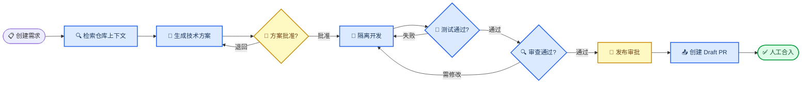
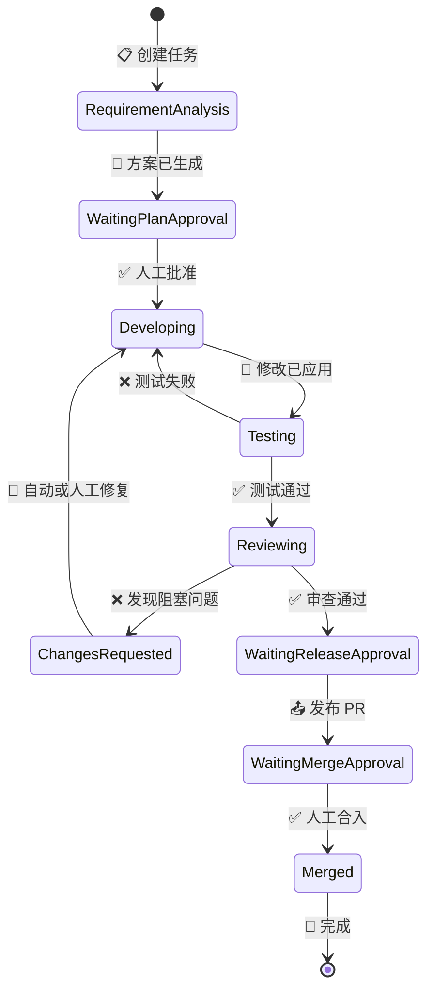

# AI Dev Agent

_一个可暂停、可恢复、可审计，并由人工 Gate 控制最终交付的软件研发 Agent 平台。_

---

## 📋 项目定位

AI Dev Agent 把一条真实的软件需求拆成可控的交付流程：读取仓库、分析需求、生成技术方案、隔离开发、执行测试、代码审查、创建 GitHub Pull Request，最终由用户决定是否合入。

它不是“让模型一次性生成代码”的 Demo，而是一套围绕 Agent 构建的研发工作台：**模型负责理解、决策和生成，LangGraph 负责流程编排，确定性工具负责执行，人工审批负责关键边界**。

| 项目属性 | 当前实现 |
| --- | --- |
| **后端** | Python 3.12+、FastAPI、Pydantic |
| **Agent 编排** | LangGraph、LangChain `create_agent`、`@tool` |
| **模型接入** | DeepSeek、Ollama、OpenAI-compatible API |
| **持久化** | SQLite、LangGraph SQLite Checkpointer |
| **代码执行** | Git Worktree、受控 Patch、仓库测试命令 |
| **代码交付** | GitHub Draft PR、评论同步、人工合入 |
| **前端** | 原生 HTML/CSS/JavaScript、Monaco Diff Editor |
| **质量保障** | 规则审查、模型审查、Golden Cases、混合 RAG 评测 |

> 📌 **核心原则：** Agent 可以自主探索和提出修改，但不能绕过批准范围、测试、审查、发布与合入 Gate。

## 🎯 核心能力

| 能力 | 解决的问题 | 主要实现 |
| --- | --- | --- |
| **仓库理解** | 避免模型凭空猜测文件和调用关系 | 仓库事实扫描、符号索引、依赖图、混合 RAG |
| **多 Agent 协作** | 将规划、开发和审查职责分离 | Plan、Repository Exploration、Developer、Reviewer Agent |
| **自主工具调用** | 按问题需要补充上下文 | `search_text`、`search_symbol`、`find_references`、`read_file`、`git_history` |
| **受控代码修改** | 防止越权修改和 Patch 污染 | 文件范围、ToolPolicy、结构校验、Git 基线恢复 |
| **测试与自动修复** | 让失败形成闭环 | Apply → Test → Diagnose → Repair，最多三轮 |
| **独立代码审查** | 防止“开发 Agent 自己证明自己正确” | 确定性规则与 LLM Review 双重检查 |
| **暂停与恢复** | 支持长任务中断、进程退出和人工暂停 | Job 租约、心跳、五类检查点、恢复诊断 |
| **可观测性** | 回答 Agent 做了什么、为何失败 | Trace、Span、模型/工具调用、Token、实时任务时间线 |
| **GitHub 交付** | 将本地修改变成可审核成果 | `agent/*` 分支、Draft PR、Review Comment、人工 Merge |
| **UI 验收** | 对页面需求补充可视化证据 | Figma MCP、浏览器截图、DOM 与视觉差异报告 |

当前属于**顺序协作型 Multi-Agent**：各 Agent 按交付阶段接力，Developer 与 Reviewer 内部允许有界循环，但不会无约束地并行修改同一工作区。

## 🔄 交付流程

一条需求从创建到合入会经过以下主链路。测试失败回到开发修复，审查发现阻塞问题也回到开发；发布 PR 和合入始终需要人工操作。



流程中的责任边界如下：

1. **需求阶段**：收集仓库事实，生成需求分析、验收标准和技术方案
2. **开发阶段**：创建隔离 Worktree，Developer Agent 探索上下文并按步骤修改、测试和修复
3. **CR 阶段**：展示累计 Diff、测试证据、MR 描述和 Review Finding
4. **交付阶段**：用户确认后创建 Draft PR，再由用户决定是否 Ready 和 Merge

## ⚙️ 系统架构

系统采用“Web/API + 后台 Job + LangGraph 状态机 + Agent/Tool + Git 工作区”的分层设计。`TaskOrchestrator` 只负责命令入口和依赖适配，下一步执行哪个节点由 `TaskDeliveryGraph` 及其条件边决定。

```mermaid
flowchart TB
    accTitle: AI Dev Agent 系统架构
    accDescr: 展示浏览器、FastAPI、后台 Worker、LangGraph、Agent 层、SQLite、Git Worktree 和外部集成之间的关系

    web([👤 Web 工作台]) --> api[🌐 FastAPI]
    api --> worker[⚙️ Job Worker]
    worker --> graph[🔄 LangGraph 工作流]
    graph --> agents[🧠 Plan / Developer / Reviewer]
    graph --> database[(💾 SQLite 与 Checkpointer)]
    agents --> workspace[🔧 Git Worktree 与工具策略]
    agents --> integrations[🔌 LLM / GitHub / Figma]
    api --> database

    classDef interface fill:#f3f4f6,stroke:#6b7280,stroke-width:2px,color:#1f2937
    classDef engine fill:#dbeafe,stroke:#2563eb,stroke-width:2px,color:#1e3a5f
    classDef data fill:#dcfce7,stroke:#16a34a,stroke-width:2px,color:#14532d

    class web,api interface
    class worker,graph,agents engine
    class database,workspace data
```

| 层 | 职责 | 核心代码 |
| --- | --- | --- |
| **交互层** | 三阶段工作台、实时进度、Diff、审查与发布操作 | `apps/web/` |
| **API 层** | 参数校验、HTTP/SSE 接口、依赖装配 | `apps/api/main.py` |
| **执行层** | Job 领取、租约、心跳、取消和恢复 | `src/execution/worker.py` |
| **编排层** | 顶层交付图、状态迁移、人工中断、检查点 | `src/workflows/` |
| **Agent 层** | 规划、上下文探索、开发、审查和 MR 生成 | `src/agents/` |
| **工具层** | 文件读取、搜索、Patch、测试和策略约束 | `src/tools/` |
| **基础设施层** | SQLite、GitHub、Worktree、模型与 Trace | `src/infrastructure/`、`src/scm/`、`src/sandbox/`、`src/llm/` |

## 👥 Agents 与上下文

### Agent 分工

| Agent | 输入 | 自主行为 | 输出 |
| --- | --- | --- | --- |
| **RequirementPlanningAgent** | 需求、仓库事实、设计上下文 | 调用只读规划工具，确定影响文件和开发步骤 | 需求分析、技术方案、验收与风险 |
| **RepositoryExplorationAgent** | 初始上下文、写入范围、失败或审查反馈 | 在最多 1～8 步内自主选择只读工具 | 补充后的代码上下文与工具审计 |
| **CodeDevelopmentAgent** | 已批准方案、当前工作区、上下文 | 生成修改、应用 Patch、运行测试、诊断并修复 | Development Attempts、Diff、测试结果 |
| **CodeReviewAgent** | 需求、方案、累计 Diff、测试证据 | 执行规则审查和模型审查，选择基线恢复项 | Review Round、Finding、是否阻塞 |

### 上下文工程

系统没有把整个仓库直接塞给模型，而是按阶段组织上下文：

| 上下文层 | 内容 | 使用场景 |
| --- | --- | --- |
| **仓库事实** | 语言、框架、Git HEAD、入口、测试命令 | 创建任务和生成方案 |
| **混合 RAG** | 关键词/符号召回、本地语义向量、RRF 融合、依赖扩展 | 筛选核心、依赖和测试文件 |
| **自主探索** | 文本、符号、引用、文件和 Git 历史 | Developer 判断初始上下文不足时 |
| **修复上下文** | 上次失败、测试输出、当前 Diff、Review Finding | 测试修复、CR 修复和用户继续对话 |
| **Git 基线** | 原始代码片段与删除候选 | 恢复需求未授权删除，避免模型重新编造旧代码 |

当前语义检索使用确定性的本地哈希向量，不依赖额外 Embedding 服务；可以在保持评测接口不变的前提下替换为外部 Embedding 与向量数据库。

## 💾 状态、任务与恢复

系统把“业务走到哪一步”和“后台由谁执行”分开记录：

| 对象 | 表达的含义 | 状态来源 |
| --- | --- | --- |
| **LangGraph State** | 任务当前业务阶段、恢复位置、待人工动作 | SQLite Checkpointer，业务状态源 |
| **Task** | API 和页面读取的任务投影 | Graph 状态迁移后同步 |
| **ExecutionJob** | 某次批准、重试、恢复或审查由哪个 Worker 执行 | SQLite Job 队列 |
| **TaskCheckpoint** | 可展示、回放和恢复的安全节点 | Graph 检查点投影 |



开发链路持久化五类安全检查点：

| 检查点 | 已完成内容 | 恢复后继续执行 |
| --- | --- | --- |
| `plan_approved` | 技术方案已批准 | 创建或校验隔离工作区 |
| `proposal_ready` | 本轮修改方案已生成 | 应用修改 |
| `patch_applied` | 修改已写入 Worktree | 运行测试 |
| `test_result_saved` | 测试结果已保存 | 修复失败或生成 MR |
| `review_round_saved` | 审查轮次已保存 | 修复 Finding 或等待人工决策 |

Worker 默认每 10 秒更新一次心跳，并持有 90 秒执行租约。进程退出后心跳停止，恢复协调器只会接管租约已过期且检查点有效的 Job；继续执行前还会校验方案、仓库 HEAD、Worktree 和 Diff 是否漂移。

## 🚀 快速开始

### 前置条件

| 依赖 | 要求 | 用途 |
| --- | --- | --- |
| Python | 3.12+ | API、Agent 和 Worker |
| Git | 可执行命令行 | 仓库分析、Worktree、Diff 和提交 |
| Chrome 或 Edge | 可选 | UI 截图验收 |
| Ollama 或模型 API Key | 开发阶段必需 | 规划、开发和审查模型调用 |
| GitHub Token | 可选 | 发布和合入 Pull Request |

### 安装

```powershell
git clone https://github.com/jeff-jayden/auto_dev_agent.git
cd auto_dev_agent

python -m venv .venv
.\.venv\Scripts\Activate.ps1
python -m pip install -e ".[dev]"

Copy-Item .env.example .env
```

编辑 `.env`，至少配置可用模型。以 DeepSeek 为例：

```dotenv
MODEL_PROVIDER=deepseek
MODEL_NAME=deepseek-flash
MODEL_BASE_URL=https://api.deepseek.com
DEEPSEEK_API_KEY=your_deepseek_api_key
MODEL_TIMEOUT_SECONDS=180
AGENT_ALLOWED_REPOSITORY_ROOTS=E:\projects
```

> ⚠️ **安全提示：** `.env` 已被 Git 忽略。不要把真实 API Key 或 GitHub Token 写入 README、源码、Issue 或提交记录。

### 启动

```powershell
.\scripts\start-local.ps1
```

打开 <http://127.0.0.1:8765>，或检查健康状态：

```powershell
Invoke-RestMethod http://127.0.0.1:8765/health
```

首次使用时：

1. 在“需求”页面通过 GitHub 地址或本地目录注册仓库
2. 新建任务并填写标题、需求描述和目标仓库
3. 核对仓库事实、需求分析、影响文件和技术方案
4. 批准方案后，在“开发”页面观察实时进度、Agent 对话和累计 Diff
5. 在“代码 CR”页面处理 Finding，确认后发布 Draft PR

如果使用本地 Ollama，可直接运行 `scripts/start-ollama.ps1`；该脚本默认连接 `http://127.0.0.1:11434/v1`。

## 🔧 配置

| 环境变量 | 必需 | 默认值 | 说明 |
| --- | --- | --- | --- |
| `MODEL_PROVIDER` | 是 | `disabled` | `deepseek`、`ollama`、`openai` 或 `openai_compatible` |
| `MODEL_NAME` | 是 | 按 Provider | 模型名称 |
| `MODEL_BASE_URL` | 否 | 按 Provider | OpenAI-compatible API 地址 |
| `MODEL_API_KEY` | 按 Provider | 空 | 通用模型 API Key |
| `DEEPSEEK_API_KEY` | DeepSeek | 回退到 `MODEL_API_KEY` | DeepSeek API Key |
| `MODEL_TIMEOUT_SECONDS` | 否 | `90`～`240` | 单次模型调用超时 |
| `AGENT_ALLOWED_REPOSITORY_ROOTS` | 本地仓库 | 项目父目录 | 允许注册的本地仓库根目录，Windows 使用分号分隔 |
| `GITHUB_TOKEN` | 发布 PR | 空 | 建议使用只授权目标仓库的 Fine-grained PAT |
| `GITHUB_API_URL` | 否 | `https://api.github.com` | GitHub API 地址 |
| `FIGMA_MCP_URL` | UI 验收 | 空 | Figma Desktop MCP 地址 |
| `DEVELOPER_CONTEXT_TOOLS_ENABLED` | 否 | `true` | 是否启用 Developer 自主上下文探索 |
| `DEVELOPER_CONTEXT_MAX_STEPS` | 否 | `4` | 单轮只读探索步数，限制为 1～8 |

运行数据写入 `runtime/`：

- `runtime/agent.db`：Task、Job、Event、Trace、Evaluation 与 LangGraph Checkpoint
- `runtime/repositories/`：通过远端地址注册的仓库
- `runtime/tasks/{task_id}/repo`：任务隔离 Worktree
- `runtime/indexes/`：按仓库和 Git HEAD 缓存的代码索引
- `runtime/ui-acceptance/`：UI 验收截图与差异证据

这些内容均属于本地运行状态，不应提交到 Git。

## 📚 项目结构

```text
ai-dev-agent/
├── apps/
│   ├── api/main.py                 # FastAPI、路由、依赖装配与 Worker 生命周期
│   └── web/                        # 三阶段工作台和 Monaco Diff 界面
├── src/
│   ├── agents/                     # 规划、探索、开发、审查与 MR Agent
│   ├── code_intelligence/          # Git-aware 索引、混合 RAG 和依赖扩展
│   ├── domain/                     # Task、Plan、Job、Review、Trace 等领域模型
│   ├── evaluation/                 # Golden Cases 与检索指标评测
│   ├── execution/                  # 后台 Worker、租约、心跳和恢复执行
│   ├── infrastructure/             # SQLite 持久化
│   ├── llm/                        # 多 Provider 模型网关
│   ├── observability/              # Trace、Span 和脱敏
│   ├── repository/                 # 仓库注册、克隆和事实分析
│   ├── sandbox/                    # Git Worktree 隔离工作区
│   ├── scm/                        # GitHub API、分支、PR 和合入
│   ├── tools/                      # Developer 工具与 ToolPolicy
│   ├── workflows/                  # 顶层 LangGraph、Orchestrator 和恢复协调器
│   └── ui_validation.py            # Figma MCP 与浏览器 UI 验收
├── scripts/                        # 本地和 Ollama 启动脚本
├── tests/                          # 单元与集成测试
├── .env.example                    # 无密钥的配置模板
├── pyproject.toml                  # 包信息与依赖
└── TODO.md                         # 暂缓功能与后续计划
```

关键入口：

- `apps/api/main.py`：启动服务并构造所有依赖
- `src/workflows/workflow_graph.py`：唯一业务状态源与顶层交付图
- `src/workflows/orchestrator.py`：把 API/Worker 命令适配为 Graph 输入
- `src/execution/worker.py`：异步执行 Job 并维护心跳租约
- `src/agents/code_development_agent.py`：开发、测试和修复子图
- `src/agents/code_review_agent.py`：审查和修复子图

## ✅ 测试、API 与当前边界

### 运行测试

```powershell
python -m pytest -q
```

当前测试结果为 **107 passed**；测试集覆盖任务 API、仓库分析、上下文探索、分步开发、工具策略、后台 Job、恢复、GitHub 交付、可观测性、UI 验收和 LangGraph 工作流。

### 主要 API

启动后可访问 <http://127.0.0.1:8765/docs> 查看完整 OpenAPI 文档。

| API 组 | 代表接口 | 用途 |
| --- | --- | --- |
| **仓库** | `POST /api/repositories` | 注册本地目录或远端 Git 仓库 |
| **任务** | `POST /api/tasks` | 创建需求并生成方案 |
| **开发** | `POST /api/tasks/{id}/approve` | 批准方案并创建后台 Job |
| **反馈** | `POST /api/tasks/{id}/feedback` | 基于当前工作区继续对话和修改 |
| **恢复** | `GET /api/tasks/{id}/recovery` | 诊断中断任务并恢复 |
| **审查** | `POST /api/tasks/{id}/review/run` | 刷新工作区快照并重新审查 |
| **交付** | `POST /api/tasks/{id}/pull-request/publish` | 创建 GitHub Draft PR |
| **可观测性** | `GET /api/traces/{trace_id}` | 查看 Agent、LLM 和工具调用链 |
| **实时状态** | `GET /api/tasks/{id}/stream` | 通过 SSE 订阅任务事件 |
| **评测** | `POST /api/evaluations/run` | 运行 Golden Cases 与 RAG 对比评测 |

### 当前边界

- 后台执行器当前是单进程单 Worker，适合本地演示和单机开发，不是分布式调度系统
- SQLite 同时承载业务数据和 Checkpointer；多实例部署前应迁移到共享数据库和队列
- 混合 RAG 的语义向量是本地确定性实现，生产效果需要真实仓库标注集和正式 Embedding 模型验证
- Figma MCP 依赖 Figma Desktop Dev Mode；未配置时不影响普通代码需求
- 系统生成 Draft PR，但最终发布和合入仍由用户确认
- 仓库当前未声明开源许可证，复制、分发或商用前应先补充许可证

### 参考资料

- [LangGraph 文档](https://docs.langchain.com/oss/python/langgraph/overview)
- [LangChain Agents 文档](https://docs.langchain.com/oss/python/langchain/agents)
- [FastAPI 文档](https://fastapi.tiangolo.com/)
- [GitHub Pull Requests REST API](https://docs.github.com/en/rest/pulls/pulls)
- [Monaco Editor 文档](https://microsoft.github.io/monaco-editor/)

---

_当前版本：`0.1.0` · 最后更新：2026-09-29_
